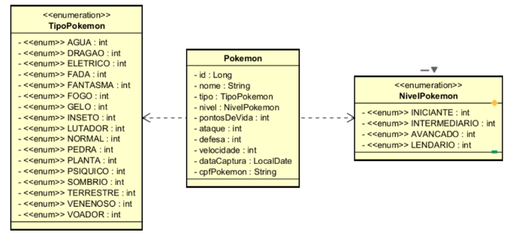

# **ProjetoJava com Spring**

## 📌 Sobre o Projeto
Este projeto é uma revisão de Java com o framework Spring, contendo operações CRUD e validações essenciais.



## 🚀 Funcionalidades

### 🔹 Métodos HTTP Implementados
- **GET**: Busca por `idPokemon` e `cpfPokemon`.
- **POST**: Cadastro de novos pokemons.
- **PUT**: Atualização de dados do pokemon.
- **DELETE**: Remoção de pokemon.

### ✅ Validações Implementadas
- **CPF duplicado**: Impede a inserção de CPFs repetidos.
- **Campos nulos**: Bloqueia requisições com valores ausentes.
- **Campos vazios**: Garante que os dados obrigatórios sejam preenchidos.
- **Campos maiores que 0**: Garante que os dados númerico sejam maior que 0.

### 🗄 Banco de Dados Suportados
- **H2** (banco em memória para testes)
- **PostgreSQL** (banco de produção)

### ⚠️ Tratamento de Erros
- Retorno de mensagens amigáveis para o usuário
- Padronização de respostas HTTP para erros comuns

---


# 🧠 **Comentários escritos por mim para facilitar a compreensão do código**

---

### 🟦 Classe: `TestConfig`

🧩 _**@Configuration**_  
📝 Indica que esta é uma classe de configuração do Spring. Ela será processada para registrar beans no contexto da aplicação.

⏱️ _**@PostConstruct**_  
🛠️ Esse método é executado automaticamente **após a injeção de todas as dependências**, ou seja, depois que o Spring inicializa o objeto.  
É utilizado aqui para **preparar o banco de dados com dados iniciais**.

```plantuml
@PostConstruct
public void initDB() {
    this.dbService.initDB();
}
```

---

### 🟦 Classe: `PokemonDTO`

🧠 **Utilização da variável int e Integer**

- 🔢 **Integer**: é um objeto que **pode ser null**.
- 🔢 **int**: é um tipo primitivo que **nunca pode ser null** (se não for definido, vira **0** automaticamente).

🔄 **Conversão automática:**
- **Integer → int**: o Java faz unboxing.
- **int → Integer**: o Java faz autoboxing.

✅ **Validações com anotações:**

- 🔒 **@NotNull**: O valor não pode ser null.
- 🚫 **@NotBlank**: O valor não pode ser null, vazio ou conter apenas espaços.

📏 **Validações numéricas:**

- ➖ **@Min(1)**: O valor deve ser ≥ 1  
- ➕ **@Positive**: O valor deve ser > 0  
- ⚖️ **@PositiveOrZero**: O valor deve ser ≥ 0

---

### 🟪 Enum: `NiveisPokemon`

🧠 Método `static` evita a criação de instâncias do enum.  
🔍 Ele transforma o `id` em um enum correspondente. Caso o `id` seja inválido, uma exceção é lançada.

```plantuml
public static NiveisPokemon toEnum(Integer id){  
    if(id == null) return null;  
    for(NiveisPokemon x : NiveisPokemon.values()){  
        if(id.equals(x.getId())) return x;  
    }  
    throw new IllegalArgumentException("Nível inválido");  
}
```

---

### 🟦 Classe: `Pokemon`

📌 _**@Entity**_  
📝 Indica que a classe é uma entidade do JPA.

📂 _**@Table(name = "pokemon")**_  
🛠️ Cria a tabela automaticamente no banco de dados com o nome "pokemon".

🆔 _**@Id**_  
📝 Marca o atributo como chave primária.

🎚️ _**@Enumerated(EnumType.ORDINAL)**_  
📝 Define que o enum será armazenado como número (posição ordinal).

🔗 **@JoinColumn(name = "tipoPokemon")**  
📝 Define a coluna que representa a chave estrangeira para outra entidade.

🚫 **@Column(unique = true)**  
📝 Garante que o valor da coluna seja único na tabela.

---

### 🟩 Interface: `PokemonRepository`

🔍 É usado para consultar o banco de dados e buscar um Pokémon com base no valor do CPF do Pokémon

```plantuml
Optional<Pokemon> findByCpfPokemon(String cpfPokemon);
```

---

### 🟦 Classe: `PokemonResource`

🌐 **@RestController**  
📝 Marca a classe como controller REST — os métodos retornam JSON.

📍 **@RequestMapping(value = "/pokemon")**  
🛠️ Define o endpoint base para os métodos do controller.

📄 **GET - Buscar todos os Pokémons**

```plantuml
@GetMapping  
public ResponseEntity<List<PokemonDTO>> findAll(){  
    return ResponseEntity.ok().body(pokeService.findAll());  
}
```

🔍 **GET - Buscar por ID**

```plantuml
@GetMapping(value = "/{id}")  
public ResponseEntity<PokemonDTO> findbyId(@PathVariable Long id){  
    Pokemon obj = this.pokeService.findbyId(id);  
    return ResponseEntity.ok().body(new PokemonDTO(obj));  
}
```

📌 **@PathVariable**  
📝 Extrai o valor diretamente da URL.

🔍 **GET - Buscar por CPF do Pokémon**

```plantuml
@GetMapping(value = "/cpfPokemon/{cpfPokemon}")  
public ResponseEntity<PokemonDTO> findById(@PathVariable String cpfPokemon){  
    Pokemon obj = this.pokeService.findbyCpfPokemon(cpfPokemon);  
    return ResponseEntity.ok().body(new PokemonDTO(obj));  
}
```

➕ **POST - Criar um novo Pokémon**

```plantuml
@PostMapping  
public ResponseEntity<PokemonDTO> create(@Valid @RequestBody PokemonDTO pokemonDTO){  
    Pokemon pokemon = pokeService.create(pokemonDTO);  
    URI uri = ServletUriComponentsBuilder.fromCurrentRequest().path("{/id}").buildAndExpand(pokemon.getId()).toUri();  
    return ResponseEntity.created(uri).build();  
}
```

🛡️ **@Valid**  
📝 Ativa as validações do DTO antes de processar a requisição.

♻️ **PUT - Atualizar Pokémon**

```plantuml
@PutMapping(value = "/{id}")  
public ResponseEntity<PokemonDTO> update(@PathVariable Long id, @Valid @RequestBody PokemonDTO objDTO){  
    Pokemon Obj = pokeService.update(id, objDTO);  
    return ResponseEntity.ok().body(new PokemonDTO(Obj));  
}
```

🗑️ **DELETE - Deletar Pokémon**

```plantuml
@DeleteMapping(value =  "/{id}")  
public ResponseEntity<PokemonDTO> delete(@PathVariable Long id){  
    pokeService.deletePokemon(id);  
    return ResponseEntity.noContent().build();  
}
```

---

### 🟦 Classe: `DBService`

🔁 **@Autowired**  
📝 Injeta uma instância já existente, evitando a criação manual.

---

### 🟦 Classe: `PokemonService`

📄 **Buscar todos os Pokémons**

```plantuml
public List<PokemonDTO> findAll(){  
    return pokeRepo.findAll().stream().map(obj -> new PokemonDTO(obj))  
            .collect(Collectors.toList());  
}
```

🔍 **Buscar por ID**

```plantuml
public Pokemon findbyId(Long id){  
    Optional<Pokemon> obj = pokeRepo.findById(id);  
    return obj.orElseThrow(() -> new ObjectNotFoundException("Pokemon não encontrado Id:" + id));  
}
```

🔍 **Buscar por CPF**

```plantuml
public Pokemon findbyCpfPokemon(String cpfPokemon){  
    Optional<Pokemon> obj = pokeRepo.findByCpfPokemon(cpfPokemon);  
    return obj.orElseThrow(() -> new ObjectNotFoundException("Pokemon não encontrado cpfPokemon:" + cpfPokemon));  
}
```

➕ **Criar Pokémon**

```plantuml
public Pokemon create(PokemonDTO pokemonDTO){  
    pokemonDTO.setId(null);  
    validaCpf(pokemonDTO);  
    Pokemon obj = new Pokemon(pokemonDTO);  
    return pokeRepo.save(obj);  
}
```

♻️ **Atualizar Pokémon**

```plantuml
public Pokemon update(Long id,  PokemonDTO objDto){  
    objDto.setId(id);  
    Pokemon oldObj = findbyId(id);  
    validaCpf(objDto);  
    oldObj = new Pokemon(objDto);  
    return pokeRepo.save(oldObj);  
}
```

🗑️ **Deletar Pokémon**

```plantuml
public void deletePokemon (Long id){  
    Pokemon obj = findbyId(id);  
    pokeRepo.deleteById(id);  
}
```

---

### ⚙️ Arquivo: `application-test.properties`

🛠️ Caminho para acessar o banco de dados de teste:

🔗 [http://localhost:8080/h2-console](http://localhost:8080/h2-console)
